# IoT based Water Quality Analysis

## Contents

1.  [Problem Statement](#problem-statement)
2.  [Abstract](#abstract)
3.  [General Description](#general-description)
4.  [Technology Stack](#technology-stack)
5.  [Results](#results)
6.  [Demo Video](#demo-video)
7.  [Implementation](#implementation)
8.  [Evaluation of all experimental tools tested](#evaluation-of-all-experimental-tools-tested)
9.  [Conclusions](#conclusions)
10. [Future Works](#future-works)
11. [Appendix](#appendix)
12. [Authors](#authors)

## PROBLEM STATEMENT
Every organism on earth needs water to survive. Verbally saying whether water is good or bad isn't very simple but with water quality tests it can be measured and studied. Water quality is used to measure the condition of water through its physical, biological and chemical characteristics. The testing is done in the context of the intended use of the water. It is not a secret that the current problem of water pollution is a serious threat to the health of humanity. The reason is quite obvious since nowadays it is practically impossible to consume water without any artificial treatment being applied. What is meant here is the fact that nowadays water cannot be used in its original form as it is taken from nature. In stark contrast, water needs to undergo various stages of special treatment that prepares it for consumption by people without any harm to their health.

Water hardness is the traditional measure of the capacity of water to react with soap, hard water requiring considerably more soap to produce a lather. Hard water often produces a noticeable deposit of precipitate (e.g. insoluble metals, soaps or salts) in containers. It is not caused by a single substance but by a variety of dissolved polyvalent metallic ions, predominantly calcium and magnesium cations, although other cations (e.g. aluminum, barium, iron, manganese, strontium and zinc) also contribute. Hardness is most commonly expressed as milligrams of calcium carbonate equivalent per liter. 

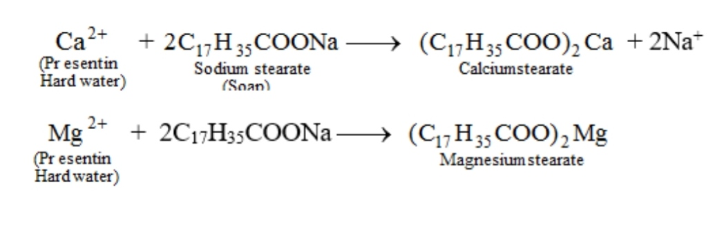

The stearates formed in the above equations reduce the capacity of water to react with soap. environmental factor, which appears to be influencing mortality, in particular.

DISADVANTAGES OF HARD-WATER

In the past five decades or so evidence has been accumulating about a cardiovascular mortality, and this is the hardness of the drinking water. In addition, several epidemiological investigations have demonstrated the relation between risk for cardiovascular disease, growth retardation, reproductive failure, and other health problems with hardness of drinking water or its content of magnesium and calcium. Refer to the Appendix section for further details of the same. 

## ABSTRACT

Smart solutions for water quality monitoring are gaining importance with advancements in technology. This project aims at informing consumers of the mineral composition of the water that they use. The inhabitants of a residential society or building can monitor the water quality and take required action by informing the concerned authorities.
Highlights of this project include a user friendly dashboard with easily understandable visualizations to understand the quality of water used on a regular basis. The IBM Cloud platform that is used here is easily accessible by a consumer at any time which increases its functionality and it also facilitates easy migration to other Cloud platforms.
For this particular undertaking, our focus is on monitoring the total dissolved salts(TDS) present in water. Additional details regarding the pH of water and the real time values of temperature and humidity is displayed as well.

## GENERAL DESCRIPTION 

The theory on real-time monitoring of water quality in an IOT environment is presented here. 

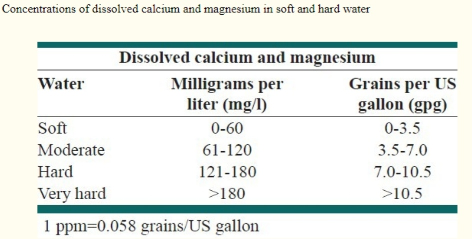

The overall block diagram of the proposed system is given in the Simulation Set up.

The entire design of the system is based on IOT which is a newly introduced concept in the world of technology. There are two parts included, hardware & software. 

The hardware part has sensors which help to measure the real-time values. The Arduino Atmega328 microcontroller converts the analog values to digital values, the ESP8266 Wi-Fi module gives the MQTT connection between the hardware and software components when connected to a Wi-Fi network. It sends device data as per MQTT protocol.

The solution is developed entirely on IBM Cloud using Watson IoT platform along with Node-RED. A database on Cloudant is required for storing the historical data and also the run time data. Node Red is a low-code development environment used for wiring the Watson and Cloudant components together. And finally we use the built in dashboard nodes that come with Node-RED to perform analysis on the data procured by the sensor and plot graphs to give a precise report on the quality of the water which can be accessed by any user with the URL provided to access the Web service.

## TECHNOLOGY STACK

### 	Arduino UNO

Arduino Uno is a microcontroller board based on the ATmega328P.The ATmega328 is a single-chip simple, low-powered, low-cost micro-controller.

### 	ESP8266
Arduino is connected to the internet by adding ESP8266 Wi-Fi Module. The ESP8266 Wi-Fi module is a complete Wi-¬Fi network which provides wireless internet access interface to any microcontroller¬ based design on its simple connectivity through Serial Communication or UART interface.

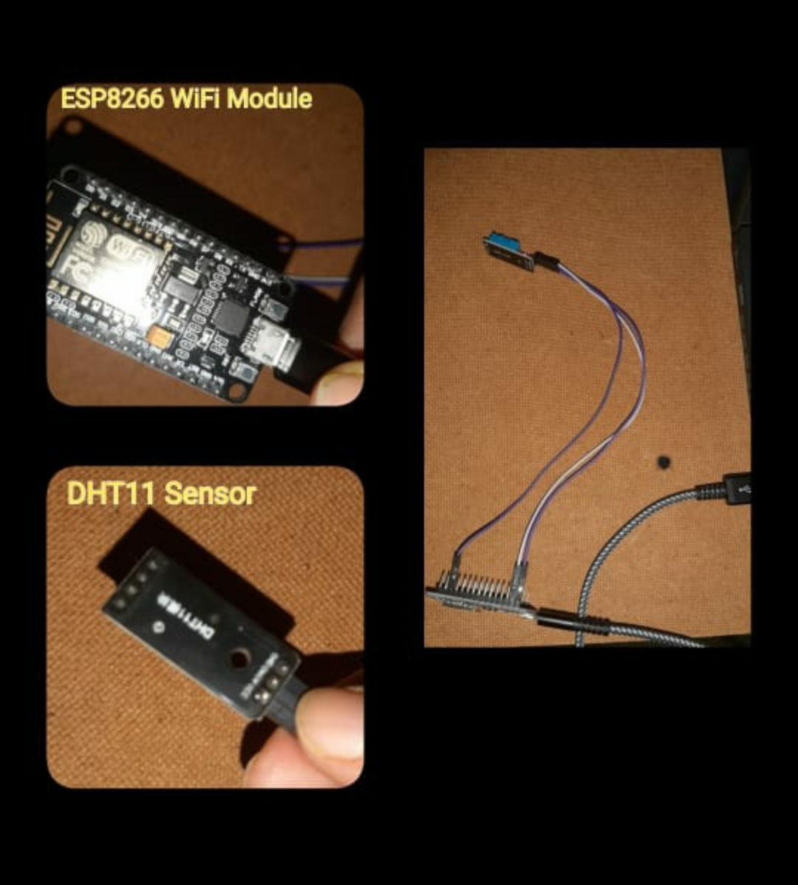

### 	DHT11 sensor
The DHT11 is a commonly used Temperature and humidity sensor. The sensor comes with a dedicated NTC to measure temperature and an 8-bit microcontroller to output the values of temperature and humidity as serial data. The sensor is also factory calibrated and hence easy to interface with other microcontrollers.
Note: For the purpose this project, the pH and TDS values used here are taken from City datasets.

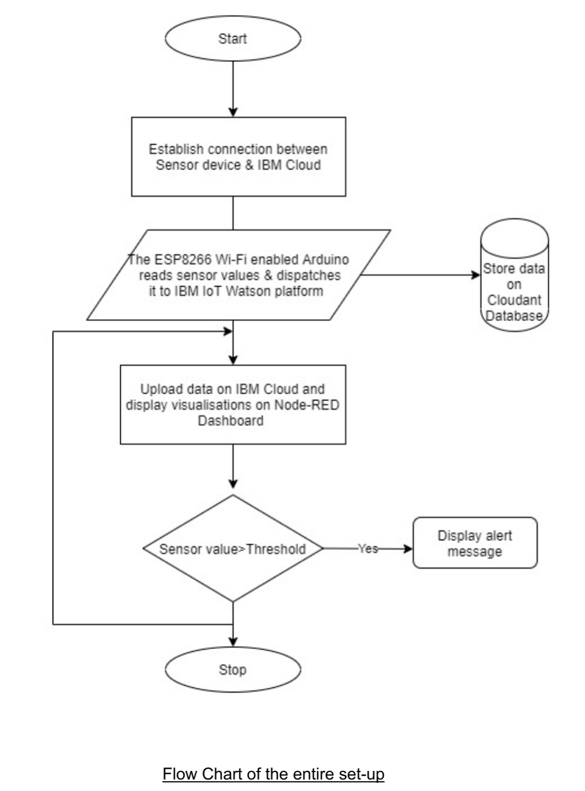

### 	IBM Cloud 
The IBM Cloud platform is composed of multiple components that work together to provide a consistent and dependable cloud experience. Developers can use IBM services to create, manage, run and deploy various types of applications for the public cloud, as well as for local or on-premises environments. IBM Cloud supports various programming languages, such as Java, Node.js, PHP and Python. 

### 	Node Red 
Node-RED is a flow-based development tool for visual programming developed originally by IBM for wiring together hardware devices, APIs and online services as part of the Internet of Things. Node-RED provides a web browser-based flow editor, which can be used to create JavaScript functions. The Node-RED dashboard is an add-on module that lets you create live dashboards.

### 	Watson IoT platform
An IoT platform is a multi-layer technology that enables straightforward provisioning, management, and automation of connected devices within the Internet of Things universe. It basically connects your hardware, however diverse, to the cloud by using flexible connectivity options.
Watson IoT Platform is a managed, cloud-hosted service designed to make it simple to derive value from your IoT devices.

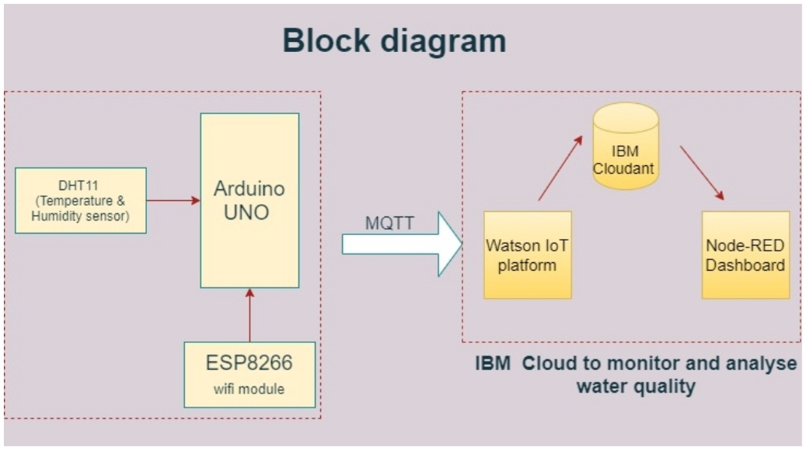

## RESULTS

In this Water quality monitoring framework, when the device connections are established, the sensors track various water parameters. Then, the composed data of water parameters are transmitted to the web server wirelessly by using WI-FI module. In our proposed system a DHT sensor is connected to the ESP8266 Wi-Fi module. This sensor measures Temperature and Humidity parameters of the water when they are dipped in water. The information is monitored frequently and presented. The data is sent to Watson IOT platform which is on IBM Cloud server as MQTT protocol (event payloads) from the device and records are stored in a database on Cloudant with the help of the Node red programming tool that wires the Watson and Cloudant together. The Node-RED Dashboard is used to plot graphs according to our requirements to give a visually appealing understanding of the run time data and historical data. This can be viewed by users using just a URL across any location to check the water quality of their households and take necessary actions.

The button with three horizontal stripes on the top-left corner of the web-page lets the user navigate between the different types of visualizations. 

The below image shows a temperature and humidity gauge which has been designed using the DHT11 sensor. The rest of the gauges show values taken from a public dataset. Our previous approach included simulating data generated by hand held devices to produce similar gauges/graphs. An alert message can also be seen at the bottom right indicating the degree of hardness of water in accordance with optimum values suggested by the water department. 

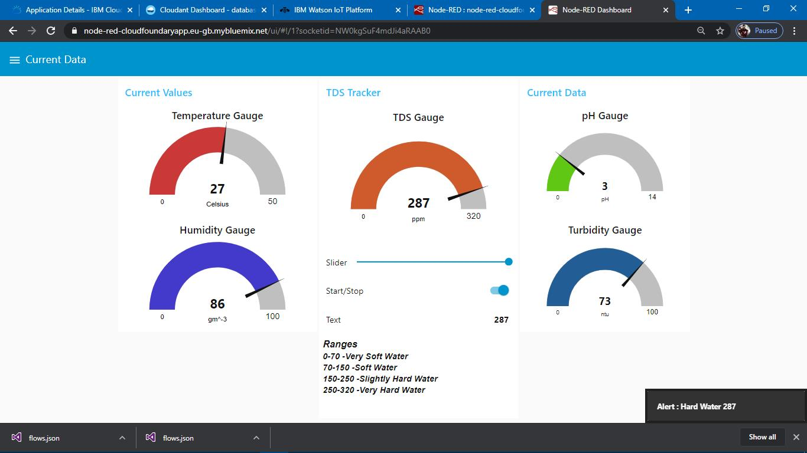

The below image shows historical data over a set short period of time. 

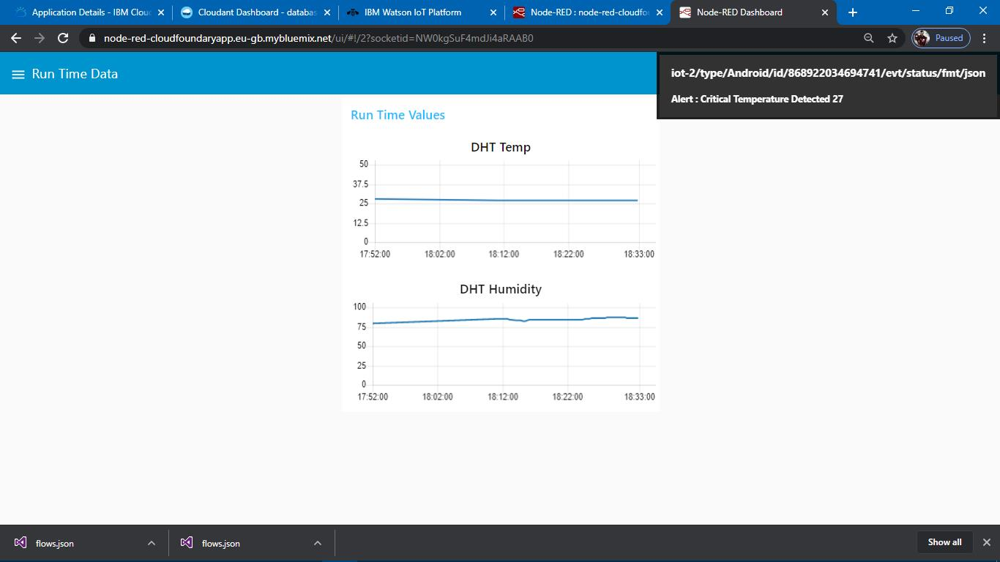

The below image shows a histogram of historical data ranging over 12 months.

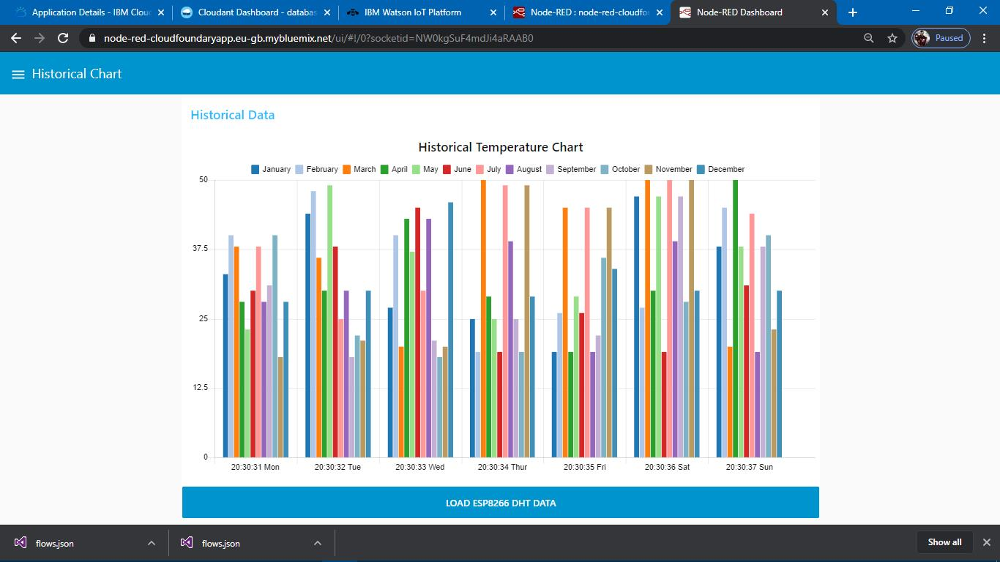

The following link enables any user to access data remotely without having to create any IBM account or download any application/software.

https://node-red-cloudfoundaryapp.eu-gb.mybluemix.net/ui/#!/0?socketid=KEZs59HbwqJprgQmAABU

## DEMO VIDEO

The youtube link given below is the demo video of our project.

## IMPLEMENTATION

A few screenshots of the step-wise execution have been added below.

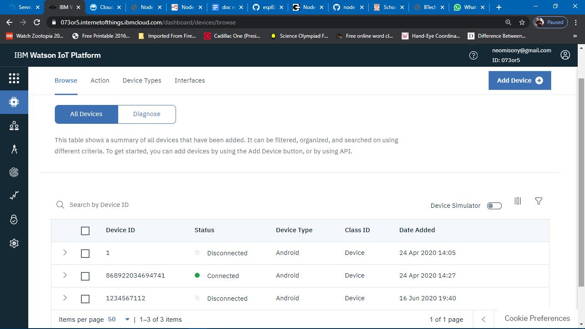

The above image shows the sensor device status at any given time whether it is connected or not.

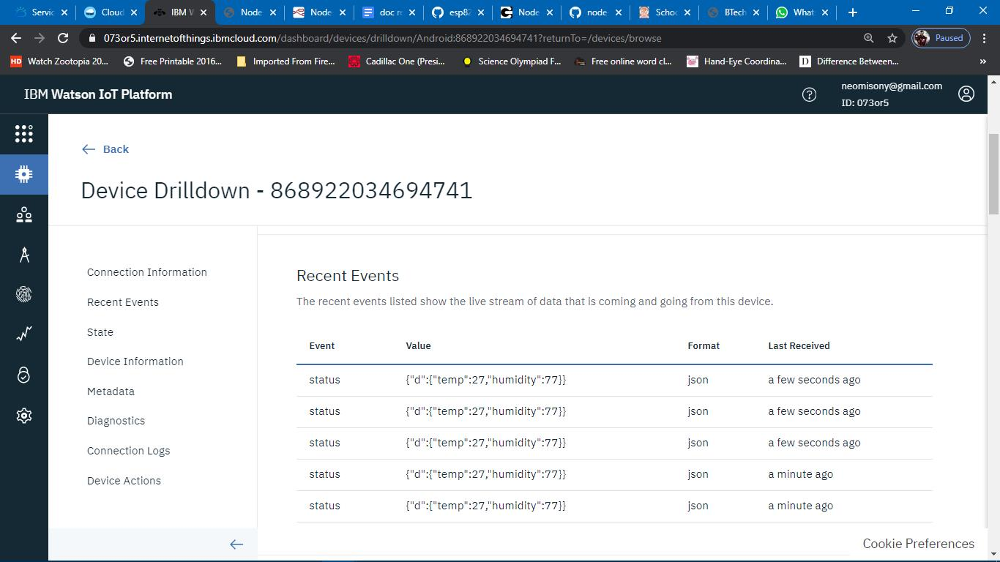

The above image shows incoming data from the sensor which is intercepted by the IBM Watson IoT Platform.

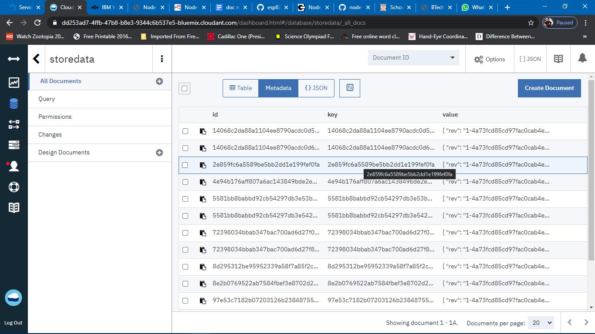

The above image shows the Cloudant database where the incoming data from the sensors is saved for historical data references.

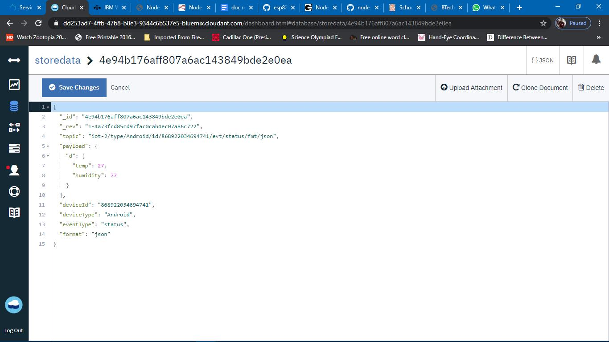

The above image shows the contents of a database on Cloudant called ‘storedata’.This JavaScript payload was modified according to the project’s needs.

Below are a couple of screenshots of the Node-RED nodes which manifests into the final visualizations.

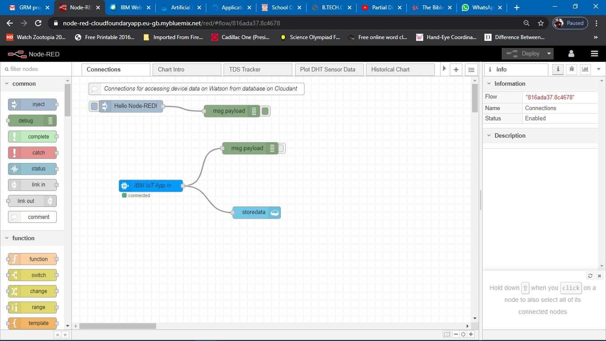

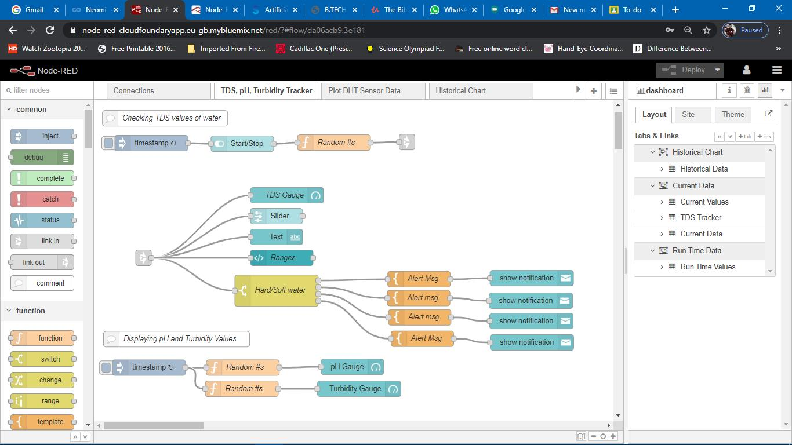

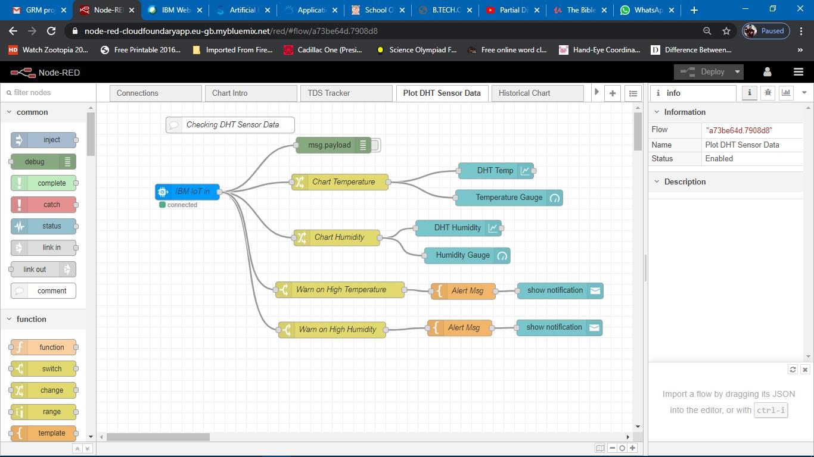

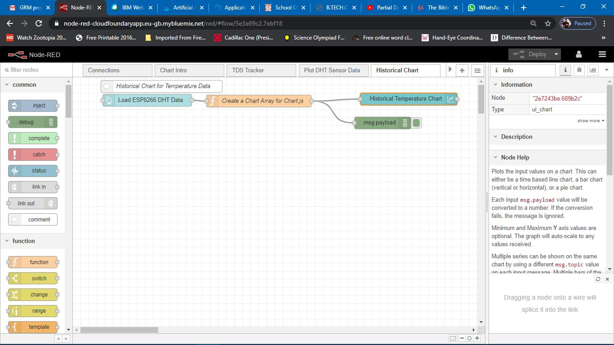

## EVALUATION OF ALL EXPERIMENTAL TOOLS TESTED

The pros found in each of the following tools impelled us to dig deeper into that service until the cons forced us to switch to another befitting IBM tool which satisfied all our prerequisites.The efforts were directed towards finding the best tool for all our visualization needs

### •	IBM IoT Watson Platform

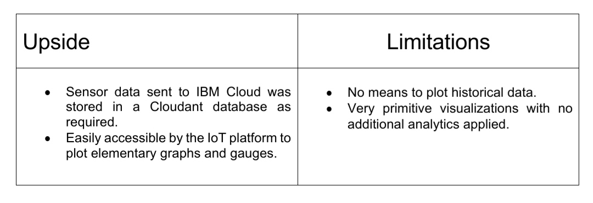

### •	IBM Cognos Analytics

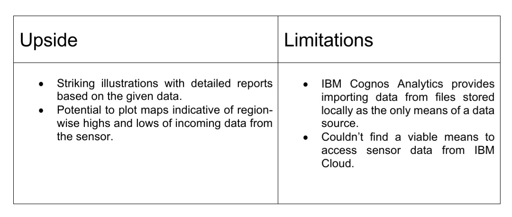

### •	IBM Watson Studio

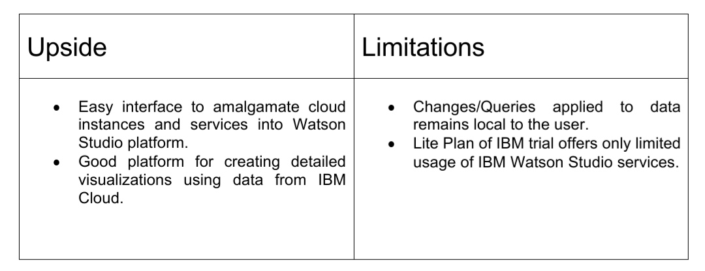

The detailed analysis of the above IBM tools led us to settle upon Node-Red Dashboard as the primary console and visualization platform. 

## CONCLUSIONS

Monitoring of TDS of water helps us have an easy way to check the quality of water at households. The system can monitor water quality automatically, and it is low in cost and does not require people on duty. The time interval of monitoring might be changed depending upon necessity. So the process of water quality testing is likely to be more economical, convenient to use and reliable. The system has good flexibility. Only by replacing the corresponding sensors and changing the relevant software programs, this system can be used to monitor other water quality parameters as well. The operation is simple. The system can be expanded to monitor hydrologic, air pollution, industrial and agricultural production and so on. It has widespread application and extensive value. 

## FUTURE WORKS

❏	Extending the project by including other appropriate hardware to test other parameters of water like turbidity, pH,etc.

❏	Development of a mobile application for easier accessibility and use of the product.

❏	Expanding the target audience base by making it available for industries and other big giants.

## APPENDIX

### Disadvantages of Hard Water

	Washing: Hard water, when used for washing purposes, does not producing lather freely with soap. As a result, cleaning quality of soap is decreased and a lot of it is wasted.

	Bathing: Hard water does not lather freely with soap solution, but produces sticky scum on the bathtub and body. Thus, the cleaning quality of soap is depressed and a lot of it is wasted.

	Cooking: The boiling point of water is increased because of presence of salts. Hence more fuel and time are required for cooking. 

	Drinking: Hard water causes bad effects on our digestive system. Moreover, the possibility of forming calcium oxalate crystals in urinary tracks is increased. 2. Industrial Use:

	Textile Industry: Hard water causes wastage of soap. Precipitates of calcium and magnesium soaps adhere to the fabrics and cause problem.

	Sugar Industry: The water which containing sulphates, nitrates, alkali carbonates are used in sugar refining, cause difficulties in the crystallization of sugar.

	Dyeing Industry: The dissolved salts in hard water may reacts with costly dyes forming precipitates. 

	Paper Industry: Calcium, magnesium, Iron salts in water may affect the quality of paper.

	Pharmaceutical Industry: Hard water may cause some undesirable products while preparation of pharmaceutical products. 

	For steam generation, boilers are almost invariably employed. If the hard water is fed directly to the boilers, there arise many troubles such as: Scales & sludges formation, Corrosion, Priming & Foaming and Caustic embrittlement.

	The minerals in hard water can also change the pH balance of your skin, weakening it as a barrier against harmful bacteria and infections. People with eczema may be especially vulnerable.

## AUTHORS

R. Darsini,
PES University,
Bangalore, Karnataka.					

Neomi Sony,
CUSAT,
Kochi, Kerala.

